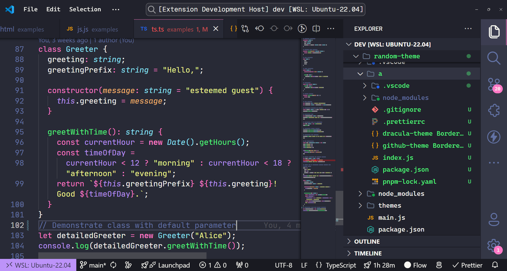
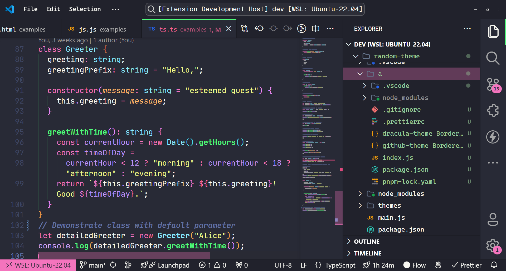
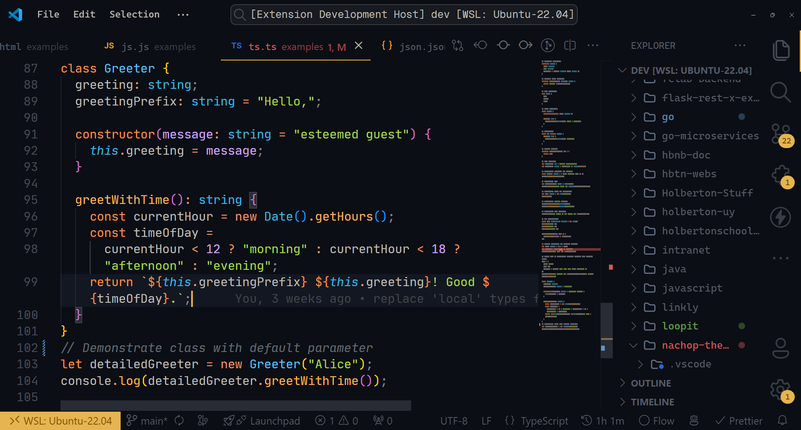
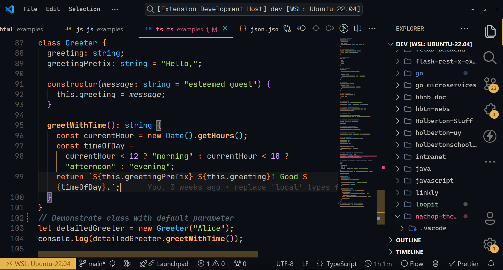

In the previous guides, we learned how to create a new theme from scratch. The focus of this page is to show the results of recreating existing themes.

## Dracula

Original theme: 

Recreation: 

## Ayu Theme

Original theme: 

Recreation: 
