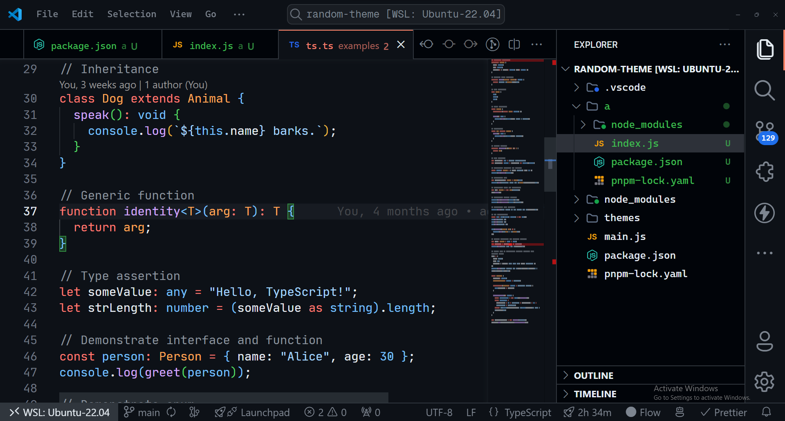
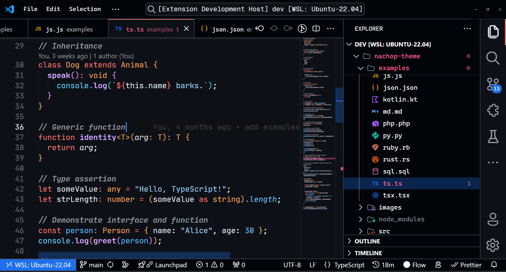

Let's do something fun! We'll try to recreate the **GitHub theme** using the VS Theme Builder. This guide will walk you through the process of creating a new theme, modifying the colors, and exporting the theme to a VS Code extension.

## Requirements

I will be using `node v22.0.0` and `pnpm v9.1.2` for this guide. You can use `npm` or the package manager of your choice.

:::note
VS Code version is `1.94.0` but it should work with some older versions as well.
:::

## Project Setup

First, let's create a new blank node project using `pnpm` (or `npm`).

```bash title=bash
pnpm init
# npm init -y
```

The project structure should look like this:

```plaintext
github-theme/
├── package.json
```

And the `package.json` file should look something like this:

```json title=package.json
{
  "name": "github-theme",
  "version": "1.0.0",
  "description": "",
  "main": "index.js",
  "scripts": {
    "test": "echo \"Error: no test specified\" && exit 1"
  },
  "keywords": [],
  "author": "",
  "license": "ISC"
}
```

### Install `vs-theme-builder`

Next, install the `vs-theme-builder` package as a dev dependency.because we only need it during development.

```bash title=bash
pnpm add -D vs-theme-builder
# npm install --save-dev vs-theme-builder
```

Now the project structure should look like this:

```plaintext
github-theme/
├── node_modules/
├── package.json
└── pnpm-lock.yaml
```

### Modify `package.json`

Now the `package.json` should be updated with the `vs-theme-builder` package.

Let's also set the `type` to `module` to be able to use ES modules, and add a `dev` script to watch the `index.js` file for changes.

```diff lang=json title=package.json
{
  "name": "github-theme",
  "version": "1.0.0",
  "description": "",
+  "type": "module",
  "main": "index.js",
  "scripts": {
+   "dev": "node --watch index.js"
  },
  "keywords": [],
  "author": "",
  "license": "ISC",
+  "devDependencies": {
+    "vs-theme-builder": "^2.0.2"
+  }
}
```

### Create `index.js`

Lastly, create an `index.js` file in the root of the project.

```bash title=bash
touch index.js
```

We will be using this file to develop our theme, so the project structure should look like this:

```plaintext
github-theme/
├── node_modules/
├── package.json
├── pnpm-lock.yaml
└── index.js
```

And that's it! We are all set up and ready to start creating our theme.

## Start creating the theme

We can use just plain JavaScript to create the theme, but we can also use TypeScript if we want. For the simplicity of this guide, we will use JavaScript.

First, inside the `index.js` file,
we will import the functions we need from the `vs-theme-builder` package.

```javascript title=index.js
import { buildThemeFromColors } from 'vs-theme-builder';
```

Next, let's declare a variable named `colors` where we will to set the colors for the theme, and I will type the variable using JSDoc to have better intellisense.

```diff lang=javascript title=index.js
import { buildThemeFromColors } from 'vs-theme-builder';

+/**
+ * @type {import('vs-theme-builder').ColorScheme}
+ */
+const colors = {};
```

### Analyze the GitHub theme

To recreate the GitHub theme, we need to analyze the colors used in the theme. Based on a screenshot we can use a color picker tool to get the colors.

For what kind of colors are we looking for?

We need to extract backgrounds, foregrounds, code syntax colors, and UI colors, like primary, accent, etc.

After analyzing this screenshot:



### Extracting colors

We can extract the following colors:

```diff lang=javascript title=index.js
import { buildThemeFromColors } from 'vs-theme-builder';

/**
 * @type {import('vs-theme-builder').ColorScheme}
 */
const colors = {
+  editor: {
+    bg: '#0d1117',
+    fg: '#f0f6fc',
+    cursor: "#2f81f7",
+    lineNumber: "#e6edf3",
+  },
+
+  ui: {
+    bg: "#010409",
+    fg: "#f0f6fc",
+    border: "#3d444d",
+  },
+
+  primary: "#1f6feb",
+  primaryContent: "#f0f6fc",
+  accent: "#f78166",
+
+  syntax: {
+    comment: "#9198a1",
+    keyword: "#ff7b72",
+    numeric: "#79c0ff",
+    const: "#59c0ff",
+
+    variables: "#e6edf3",
+    func: {
+      name: "#d2a8ff",
+      params: "#ffa657",
+    },
+
+    punctuation: "#e6edf3",
+
+    class: "#ffa657",
+    string: "#a5d6ff",
+  },
}
```

And like that, we have just extracted 20 colors from the GitHub theme, and that's all we need to create the theme. The only thing left is to build the theme using the `buildThemeFromColors` function.

### Build the theme

Using the function that we imported at the beginning, we can build the theme using the colors we extracted.

```diff lang=javascript title=index.js
...
+const theme = buildThemeFromColors({
+  isBordered: true,
+  name: "github-theme",
+  colors: colors,
+});
```

Now we have the theme object, in order to test the theme, we need to save it to a file.

## Save the theme and test it

To save the theme to a file, we can use the `fs` module that comes with Node.js.

```diff lang=javascript title=index.js
import { buildThemeFromColors } from 'vs-theme-builder';
+import { writeFileSync } from 'fs';

...

const theme = buildThemeFromColors({
  isBordered: true,
  name: "github-theme",
  colors: colors,
});

+writeFileSync('github-theme.json', JSON.stringify(theme));
```

### Run the script

To run the script, we can use the `dev` script we created earlier.

```bash title=bash
pnpm dev
```

This will create a `github-theme.json` file in the root of the project.

```plaintext
github-theme/
├── github-theme.json
├── node_modules/
├── package.json
├── pnpm-lock.yaml
└── index.js
```

## Test locally

Now we that we have the theme file, let's setup vscode.

The idea here is to create a local extension that will contain the theme and launch a new window with the theme applied.

### Configuring a local extension

We'll need to create a `.vscode` folder and set up a `launch.json` file to launch a new window with the theme.

```bash title=bash
mkdir .vscode
touch .vscode/launch.json
```

Inside the `launch.json` file, we can add the following configuration:

```json title=.vscode/launch.json
{
  "version": "0.2.0",
  "configurations": [
    {
      "name": "Launch Extension",
      "type": "extensionHost",
      "request": "launch",
      "args": ["--extensionDevelopmentPath=${workspaceFolder}"],
      "outFiles": ["${workspaceFolder}/out/**/*.js"]
    }
  ]
}
```

Project structure:

```plaintext
github-theme/
├── .vscode/
│   └── launch.json
├── github-theme.json
├── node_modules/
├── package.json
├── pnpm-lock.yaml
└── index.js
```

### Configure package.json

Then we need to properly set the `package.json` to include the configuration for the (local) theme extension

```json title=package.json
{
  ...
  "engines": {
    "vscode": "^1.82.0"
  },
  "categories": [
    "Themes"
  ],
  "contributes": {
    "themes": [
      {
        "label": "My GitHub Theme",
        "uiTheme": "vs-dark",
        "path": "./github-theme.json"
      }
    ]
  }
}
```

We are all set up to test the theme locally.

### Launch the extension

Lastly, we can launch the extension by hitting `F5` in VS Code, or search for `Run` in the title bar and click on `Start Debugging`.

This will open a new window with the theme applied.

---

Here is the result of the GitHub theme we just created:



Close enough, right? We can always tweak the colors to get a better match. But from only 20 colors, we were able to recreate the GitHub theme.

The [Color Scheme](/docs/types/color-scheme) type allows some other optional properties to customize even more the theme, but that is on you to explore.

## Conclusion

It may look not exactly the same, because of the decisions internally took by the package, but it's pretty close. You can always tweak the colors to get a better match, that's the good thing about `vs-theme-builder`.

Instead of directly creating the theme, you can try to create a schema first, then tweak the colors, and finally build the theme. Or you can directly build the theme and tweak the colors before saving the theme to a file.

That's it! You have successfully created your first theme using the VS Theme Builder.
